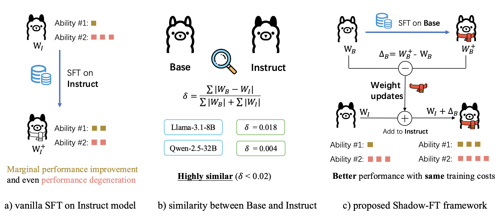

# Shadow-FT
Official code for paper "Shadow-FT: Tuning Instruct via Base"

  <a href="https://arxiv.org/pdf/2505.12716"><b>[📜 Paper]</b></a> •
  <a href="TBD"><b>[🤗 HF Models]</b></a> •
  <a href="https://github.com/wutaiqiang/Shadow-FT"><b>[🐱 GitHub]</b></a>

This repo contains the code for our paper: <a href="https://arxiv.org/abs/2411.06839" target="_blank">Shadow-FT: Tuning Instruct via Base</a> by <a href="https://wutaiqiang.github.io" target="_blank">Taiqiang Wu*</a> <a href="https://rummyyang.github.io/" target="_blank">Runming Yang*</a>, Jiayi Li, Pengfei Hu, Ngai Wong and Yujiu Yang.

\* for equal contributions.

There is an <a href="TBD" target="_blank"> explanation blog </a> for this paper (in Chinese).


## Overview



Observation:

- directly tuning the INSTRUCT (i.e., instruction tuned) models often leads to marginal improvements and even performance degeneration. 

- paired BASE models, the foundation for these INSTRUCT variants, contain highly similar weight values (i.e., less than 2% on average for Llama 3.1 8B). 

$\Rightarrow$ we propose Shadow-FT framework to tune the INSTRUCT models by leveraging corresponding BASE models. The key insight is to fine-tune the BASE model, and then _directly_ graft the learned weight updates to the INSTRUCT model.


## Quick start

The training codes are basically built on  <a href="https://github.com/hiyouga/LLaMA-Factory" target="_blank">LLaMA-Factory</a>.
For evaluation, we employ the <a href="https://github.com/open-compass/opencompass" target="_blank">OpenCompass</a> framework.
Both are *Tremendous* projects and you can find nearly everything there, thanks to their great framework and beautiful code!


### Environment

The env for LLaMA-Factory is quite strict, please check the official repo for more details.

```bash
git clone https://github.com/wutaiqiang/Shadow-FT
cd Shadow-FT
pip install -e ".[torch,metrics]"
pip install importlib_metadata omegaconf
pip install torch==2.6.0 transformers==4.52.1 torchvision  deepspeed -U
```

Please refer to [LLaMA Factory](https://github.com/hiyouga/LLaMA-Factory/blob/main/README_zh.md#%E5%AE%89%E8%A3%85-llama-factory) for more details.

### Training data

We select 2000 samples from [BAAI Infinity-Instruct](https://huggingface.co/datasets/BAAI/Infinity-Instruct/tree/main/Gen) and save it at `data/Shadow_2k.parquet`

For the custom dataset, remember to add information at `data/dataset_info.json`.


### For Train 

Set `USE_LORA` `MODEL_DIR` `BASE_MODELS`, and then bash run.sh

set MODEL_DIR='' to download the model from huggingface, rather than local file.


After that, you will get an automatically generated bash script for training, merging, and evaluating, such as:

```text
##### Auto-generated 2025-05-22 13:54:08 #####
# Model     : Qwen2.5-14B
# LoRA mode : true
# Template  : qwen

##### Environment #####
export VLLM_WORKER_MULTIPROC_METHOD=spawn

##### Training #####
###### I  max=2000  lr=1e-5 ######
llamafactory-cli train \
  --model_name_or_path "${MODEL_ROOT}/Qwen2.5-14B-Instruct" \
  --finetuning_type lora --lora_rank 128 \
  --dataset "Shadow_2k" \
  --output_dir "${OUTPUT_ROOT}/instruct_lora" ...

##### LoRA delta‑merge #####
llamafactory-cli export \
  --base_model "${MODEL_ROOT}/Qwen2.5-14B-Instruct" \
  --lora_dir   "${OUTPUT_ROOT}/delta" \
  --output_dir "${OUTPUT_ROOT}/shadow_instruct"

##### Evaluation list #####
# ('short_name', 'model_path')
```

The use this bash file to start training!

### For Evaluate

Please refer to <a href="https://github.com/open-compass/opencompass" target="_blank">OpenCompass</a> for evaluation.


### Future Plan

[ ] Introduce evaluation srcipts in this repo.

## License

We use the Apache‑2.0 license.  Please also comply with the licenses of any upstream models and datasets.


## ☕️ Citation

If you find this repository helpful, please consider citing our paper:

```
@article{wu2025shadow,
  title={Shadow-FT: Tuning Instruct via Base},
  author={Wu, Taiqiang and Yang, Runming and Li, Jiayi and Hu, Pengfei and Wong, Ngai and Yang, Yujiu},
  journal={arXiv preprint arXiv:2505.12716},
  year={2025}
}
```

For any questions, please pull an issue or email at `takiwu@connect.hku.hk`
