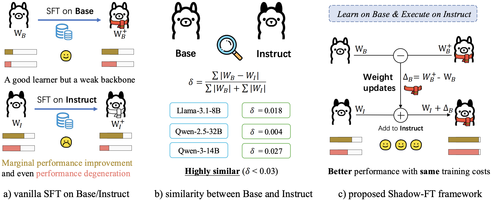

<p align="center">
 <br>
</p>

# Shadow-FT
Official code for paper "Shadow-FT: Tuning Instruct Model via Training on Paired Base Model"


  <a href="https://arxiv.org/pdf/2505.12716v3"><b>[📜 Paper]</b></a> •
  <a href="https://huggingface.co/collections/taki555/shadow-ft-683288b49e1e5e1edcf03135"><b>[🤗 HF Models]</b></a> •
  <a href="https://github.com/wutaiqiang/Shadow-FT"><b>[🐱 GitHub]</b></a>

This repo contains the code for our paper: <a href="https://arxiv.org/abs/2505.12716" target="_blank">Shadow-FT: Tuning Instruct via Base</a> by <a href="https://wutaiqiang.github.io" target="_blank">Taiqiang Wu*</a> <a href="https://rummyyang.github.io/" target="_blank">Runming Yang*</a>, Jiayi Li, Pengfei Hu, Yik-Chung Wu, Ngai Wong and Yujiu Yang.

\* for equal contributions.

There is an <a href="https://zhuanlan.zhihu.com/p/1922234702594539985" target="_blank"> explanation blog </a> for this paper (in Chinese).


## Overview



Observation:

- Directly tuning the INSTRUCT (i.e., instruction tuned) models often leads to marginal improvements and even performance degeneration. 

- Paired BASE models, the foundation for these INSTRUCT variants, contain highly similar weight values (i.e., less than 2% on average for Llama 3.1 8B). 

$\Rightarrow$ We propose the Shadow-FT framework to tune the INSTRUCT models by leveraging the corresponding BASE models. The key insight is to fine-tune the BASE model, and then _directly_ graft the learned weight updates to the INSTRUCT model.


## Quick start

The training codes are basically built on  <a href="https://github.com/hiyouga/LLaMA-Factory" target="_blank">LLaMA-Factory</a>.
For evaluation, we employ the <a href="https://github.com/open-compass/opencompass" target="_blank">OpenCompass</a> framework.
Both are *Tremendous* projects, and you can find nearly everything there, thanks to their great framework and beautiful code!


### Environment

The env for LLaMA-Factory is quite strict, please check the official repo for more details.

```bash
git clone https://github.com/wutaiqiang/Shadow-FT
cd Shadow-FT
pip install -e ".[torch,metrics]"
pip install importlib_metadata omegaconf
pip install torch==2.6.0 transformers==4.52.1 torchvision  deepspeed -U
```

Please refer to [LLaMA Factory](https://github.com/hiyouga/LLaMA-Factory/blob/main/README_zh.md#%E5%AE%89%E8%A3%85-llama-factory) for more details.

### Training data

We select 2000 samples from [BAAI Infinity-Instruct](https://huggingface.co/datasets/BAAI/Infinity-Instruct/tree/main/Gen) and save it at `data/Shadow_2k.parquet`

For the custom dataset, remember to add information at `data/dataset_info.json`.


### Similarity

Use `sigma_v2.py` to get sigma values, such as `python3 sigma_v2.py --B Qwen3-8B-Base/ --I Qwen3-8B/` 

### For Train 

Set `USE_LORA` `MODEL_DIR` `BASE_MODELS`, and then bash run.sh

set MODEL_DIR='' to download the model from Huggingface, rather than a local file.


After that, you will get an automatically generated bash script for training, merging, and evaluating, such as:

```text
##### Auto-generated 2025-05-22 13:54:08 #####
# Model     : Qwen2.5-14B
# LoRA mode : true
# Template  : qwen

##### Environment #####
export VLLM_WORKER_MULTIPROC_METHOD=spawn

##### Training #####
###### I  max=2000  lr=1e-5 ######
llamafactory-cli train \
  --model_name_or_path "${MODEL_ROOT}/Qwen2.5-14B-Instruct" \
  --finetuning_type lora --lora_rank 128 \
  --dataset "Shadow_2k" \
  --output_dir "${OUTPUT_ROOT}/instruct_lora" ...

##### LoRA delta‑merge #####
llamafactory-cli export \
  --base_model "${MODEL_ROOT}/Qwen2.5-14B-Instruct" \
  --lora_dir   "${OUTPUT_ROOT}/delta" \
  --output_dir "${OUTPUT_ROOT}/shadow_instruct"

##### Evaluation list #####
# ('short_name', 'model_path')
```

Use this bash file to start training!

### For Evaluation

Please refer to <a href="https://github.com/open-compass/opencompass" target="_blank">OpenCompass</a> for evaluation.


### Weight Similarity (σ)

`src/shadow/weight_similarity.py` reproduces the relative gap ratio σ from Section 2.3 of the paper:

$$\sigma(W_A, W_B) = \frac{\sum |W_A - W_B|}{\sum |W_A| + \sum |W_B|}$$

Lower σ means the two checkpoints share more of their weight mass — which is the empirical
foundation of Shadow-FT (a paired Base/Instruct share ≳98% of weight mass, so a delta
trained on Base transfers cleanly to Instruct).

The script iterates **one transformer layer at a time** by parsing
`model.safetensors.index.json`, so it works for 70B+ checkpoints without loading the
whole state dict.

**Usage:**

```bash
python3 src/shadow/weight_similarity.py \
    --B <path_to_base_model> \
    --I <path_to_instruct_model>
```

Only three third-party packages are used: `numpy`, `torch`, `safetensors`
(all already pulled in by the standard LLaMA-Factory install above).

**Reference σ values (from our runs):**

| Base (--B)                   | Instruct (--I)                   | σ      |
|------------------------------|----------------------------------|--------|
| `Qwen3-4B-Base`              | `Qwen3-4B-Instruct-2507`         | 0.0562 |
| `Qwen3-4B-Base`              | `Qwen3-4B-Base-Ins`              | 0.0558 |
| `Qwen3-4B-Base-Ins`          | `Qwen3-4B-Instruct-2507`         | 0.0057 |

**Minimal end-to-end verification (from a clean machine):**

```bash
# 1) Clone the repo
git clone https://github.com/wutaiqiang/Shadow-FT
cd Shadow-FT

# 2) Install only what this script needs
pip install numpy torch safetensors "huggingface_hub[cli]"

# 3) Download a paired Base / Instruct checkpoint (~8 GB each)
huggingface-cli download Qwen/Qwen3-4B-Base         --local-dir ./Qwen3-4B-Base
huggingface-cli download Qwen/Qwen3-4B-Instruct-2507 --local-dir ./Qwen3-4B-Instruct-2507

# 4) Run the σ analysis — expected final line: "Average sigma ... ~ 0.0562"
python3 src/shadow/weight_similarity.py \
    --B ./Qwen3-4B-Base \
    --I ./Qwen3-4B-Instruct-2507
```

If the printed average σ matches the reference value (±1e-3), the script is working correctly.


### Future Plan
We use the wonderful <a href="https://github.com/open-compass/opencompass" target="_blank">OpenCompass</a> for evaluation. Check [this](https://github.com/wutaiqiang/Shadow-FT?tab=readme-ov-file#for-evaluation) for details.


## License

We use the Apache‑2.0 license.  Please also comply with the licenses of any upstream models and datasets.


## ☕️ Citation

If you find this repository helpful, please consider citing our paper:

```
@article{wu2025shadow,
  title={Shadow-FT: Tuning Instruct Model via Training on Paired Base Model},
  author={Wu, Taiqiang and Yang, Runming and Li, Jiayi and Hu, Pengfei and Wu, Yik-Chung and Wong, Ngai and Yang, Yujiu},
  journal={arXiv preprint arXiv:2505.12716},
  year={2025}
}
```

For any questions, please pull an issue or email at `takiwu@connect.hku.hk`
